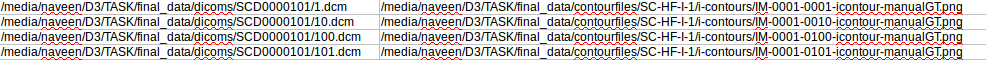
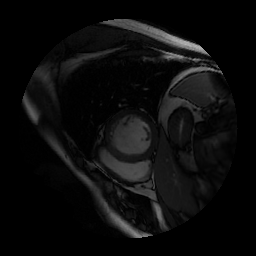

## Train Pipeline
**Run:** Place `Task1.py`,`Task2.py` and `parsing.py` in `final_data` folder and run. The folder should contain `contourfiles` and `dicom`

### Task 1
**Overview :** I have created two classes
- Patient class: containing dicom_folder, label_folded and  scans
- scan class: containing (dicom, label)
 **Why?**
 - Patient level train, validation and test split can be easily done.(Very required)
 - scan: Clubbing dicom and ground truth  together will cause less error.
 - We can perform operations such as `generate_mask()` at scan level by just adding a method.
 - Any Further Operations can be easily integrated at scan level and patient level
 
 **Output:**
generates a train.csv in same folder containg `dicom_path, groundtruth_path`

1. If  there is `IM-0001-0068-icontour-manual.txt`. Then,

Input Image             |  Gen Truth
:-------------------------:|:-------------------------:
  |  

2. if there is no `annotation` available then I created an empty image for now (Can be very easily removed/modified)

Input Image             |  Gen Truth
:-------------------------:|:-------------------------:
  |  

 **Question**
 1. How did I verify that you are parsing the contours correctly?
 -  `input_dicom*generated_mask` and saved in a folder.
 
  
 
 2.  What changes did you make to the code, if any, in order to integrate it into our production code base?
  	- I just imported parsing.py. I did not make any changes to it. I just created Task1.py
  	
### Task 2
Since task 1 has been done at both patient level and scan level. Task 2 became easy.
1. I just iterated over `num_epochs` and `each_batch` and loaded `X,Y` as numpy array of `[batch_size,height,width,channels]` as specified.
 2. If I had more time, I would have tried unit test. After talking to you I am motivated to learn robust test driven coding.
 
 **Enhancements:** It would be good to know what's the model architecture to make the pipeline more relavent.
 
